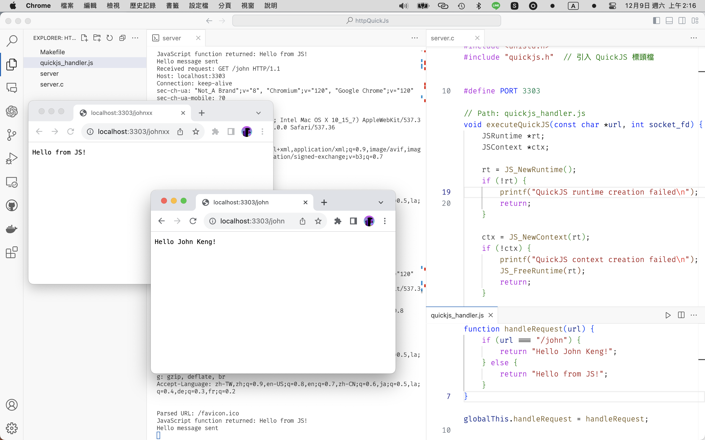

# QuickJS Request Handler

這個專案包含了一個用於處理 HTTP 請求的 server.c。根據不同的 URL， JS 會回傳不同的訊息。

## 如何使用

1. 下載或克隆此專案到你的本地電腦。
2. 在終端機中，進入專案的目錄。
3. 執行 `make` 來編譯專案。
4. 執行 `./server` 來啟動服務。

## 介紹

當你的服務啟動後，你可以透過瀏覽器或是其他 HTTP 客戶端，向你的服務發送請求。根據你的 URL，你的服務會回傳不同的訊息。例如，當 URL 為 "/john" 時，會回傳 "Hello John Keng!"，否則會回傳 "Hello from JS!"。

## server.c 檔案解析

### executeQuickJS 函數

這個函數的主要目的是執行 `quickjs_handler.js` 中的 JavaScript 程式碼。它首先創建一個新的 QuickJS 執行環境，然後讀取並執行 JavaScript 檔案。如果 JavaScript 檔案中有名為 `handleRequest` 的函數，它會被呼叫並傳入一個 URL 字串。最後，函數會將 JavaScript 函數的回傳值作為 HTTP 響應發送回客戶端。

### main 函數

這個函數創建一個新的 TCP 伺服器，並監聽 3303 連接埠。當接收到新的 HTTP 請求時，它會讀取請求內容，解析出 HTTP 方法、URL 和協議，然後呼叫 `executeQuickJS` 函數來處理請求。最後，它會關閉與客戶端的連接，並繼續等待下一個請求。

請注意，這個程式碼並未處理任何錯誤情況，例如無法開啟 JavaScript 檔案，或者 JavaScript 程式碼執行失敗等。
